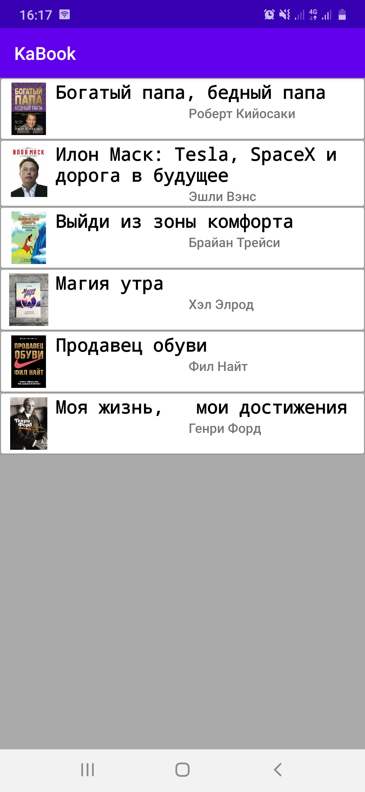
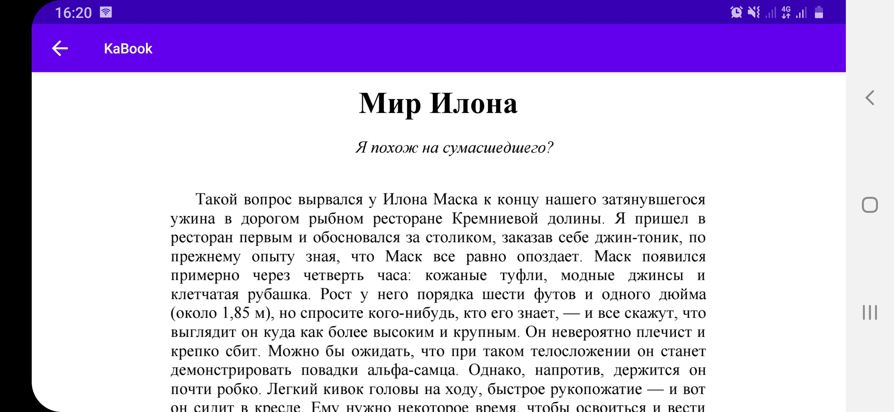

# KaBook
## Android Project)
It's my first Android project(app).
Here you can read any book from existing books. Now I have added only 6 books, but I have plans to add even more books when I have my own server for storing books. Currently, books are stored in a folder that lies in the project itself.

  "   " 

I think watching a video once is better than watching a photo 100 times. [Watch the video](https://www.youtube.com/watch?v=oY0HaVGtwnI)

### Used materials
To create the application, I used an [Android Studio](https://en.wikipedia.org/wiki/Android_Studio) and libraries that are used to create a list of books([RecyclerView](https://developer.android.com/guide/topics/ui/layout/recyclerview)) and to read pdf format([AndroidPdfViewer](https://jitpack.io/p/barteksc/AndroidPdfViewerV1))
